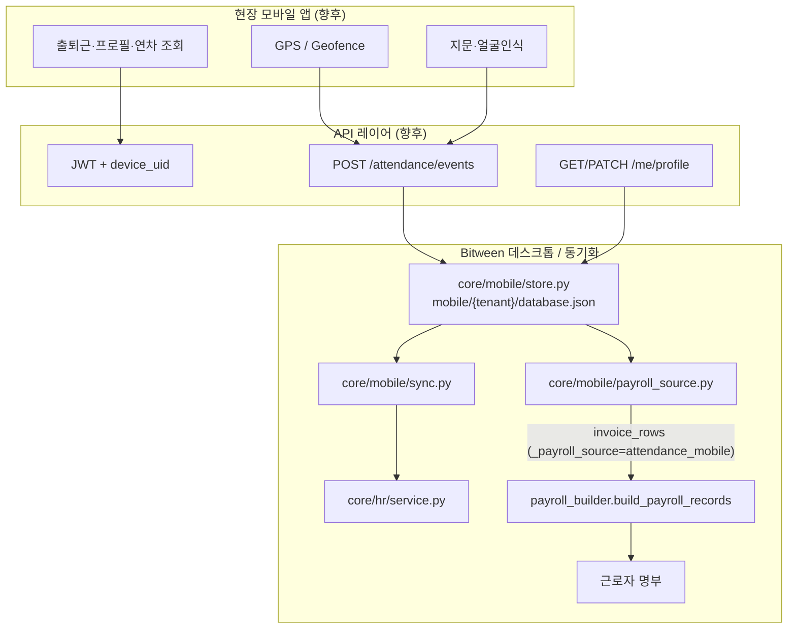

# Bitween 현장 모바일 · 출퇴근 급여 연동

Python 3 + Tkinter **Bitween** 데스크톱 플랫폼에 현장 근로자용 **모바일 앱**을 연동하기 위한 아키텍처·API 개요·로드맵입니다.  
본 문서와 `core/mobile/` 스캐폴드는 **기반 작업**이며, 네이티브 앱·HTTP API는 후속 단계에서 구현합니다.

## 현재 코드베이스 현황 (갭 분석)

| 영역 | 기존 구현 | 모바일 연동 갭 |
|------|-----------|----------------|
| **근태** | `core/hr/service.py` — 수동 근태 레코드(지각·출장 등) | GPS·생체 검증 출퇴근 없음 |
| **급여** | `main.py` — 도급비 **청구서(.xlsx) 업로드** 필수 | 출퇴근 누적 → 급여 소스 타입 없음 |
| **연차** | `annual_leave_manager.py`, HR leave 탭 | 모바일 실시간 잔여 조회 API 없음 |
| **명부** | `roster_constants.py`, `bank_account.py` — 계좌·휴대폰 | 이메일·명세서 수신 주소 필드 확장(스캐폴드 반영) |
| **사업장** | KPI `sites`, 명부 `근무지`, workflow 사업장 보고 | GPS 좌표·반경(geofence) 마스터 없음 → **신규** |
| **인증** | `core/session_service.py` — 데스크톱 로그인 | 모바일 기기·JWT·직원 바인딩 없음 |
| **테넌트** | `core/tenant_data_scope.py` — 법인별 데이터 격리 | 모바일 API에도 동일 tenant_id 적용 필요 |
| **API** | 워크플로우 등 **서비스 함수** (HTTP 래퍼 TODO) | REST/WebSocket 레이어 미구현 |

## 통합 아키텍처



### 데이터 모델 (`core/mobile/models.py`)

| 모델 | 용도 |
|------|------|
| `SiteGeofence` | 사업장명·위도·경도·반경(m) — KPI `site_name`·명부 `근무지`와 매칭 |
| `EmployeeDevice` | 직원 ↔ 기기 UID (android/ios) |
| `BiometricEnrollmentRef` | 생체 템플릿은 외부 vault, Bitween에는 `external_ref`만 |
| `AttendanceEvent` | clock_in/out, GPS, 검증 결과, work_minutes |
| `PeriodWorkSummary` | 월·사업장별 근무일/시간 — **청구서 대체 입력** |

### 저장 경로

- `{app_data_dir}/mobile/{tenant_id}/database.json`
- 개발: `급여프로그램/mobile/{tenant}/database.json` (module_store 규칙)
- `core/module_store.py` 패턴 — HR·KPI·워크플로우와 동일

### 급여: 청구서 없이 근무시간 반영

1. 모바일에서 verified `AttendanceEvent` 누적  
2. `payroll_source.aggregate_period_hours(period)` → `PeriodWorkSummary`  
3. `summaries_to_invoice_rows()` → `build_payroll_records` 호환 dict  
   - `base_days` / `work_hours` ← 집계 시간  
   - `_payroll_source`: `attendance_mobile`  
4. `services/workplace_hours.py` 정책(209h 고정 vs 청구서 시간)과 병행 설정 가능 (후속)

기존 청구서 파이프라인(`main.py` → `extract_invoice_data`)과 **병렬 소스**로 두고, 급여월·사업장별로 소스 선택 UI를 추가하는 것이 Phase 3 목표입니다.

### HR·연차 연동

- `sync.push_verified_to_hr()` — verified 이벤트를 HR 근태 탭에 미러  
- 연차 잔여: `annual_leave_manager` + HR leave_records → 모바일 `GET /me/leave` (향후)  
- 입·퇴사: `core/hr/roster_sync.py`와 명부 `근무지` 동기화

### 직원 프로필 (`core/mobile/profile.py`)

- 모바일 전용: `email`, `payslip_email`, `phone`, 계좌  
- `roster_constants`에 `이메일`, `급여명세서이메일` 별칭 추가  
- `apply_profile_to_roster_row()` — HR 승인 후 명부 반영 (선택)

## API 개요 (향후 HTTP)

모든 엔드포인트는 `Authorization: Bearer <jwt>` + `X-Tenant-Id` (또는 JWT claim) 로 테넌트 격리.

| Method | Path | 설명 |
|--------|------|------|
| POST | `/api/mobile/v1/auth/device` | 기기 등록·직원 바인딩 |
| POST | `/api/mobile/v1/attendance/events` | 출퇴근 1건 → `ingest_attendance_event` |
| GET | `/api/mobile/v1/me/profile` | 프로필·계좌·연차 요약 |
| PATCH | `/api/mobile/v1/me/profile` | 이메일·계좌 수정 |
| GET | `/api/mobile/v1/me/payroll/preview?period=YYYY-MM` | 누적 급여 미리보기 |
| GET | `/api/mobile/v1/sites/geofences` | 배정 사업장 geofence 목록 |
| POST | `/api/mobile/v1/biometric/enroll` | 등록 ref 저장 (템플릿은 vault) |

데스크톱 Bitween 관리자:

| Method | Path | 설명 |
|--------|------|------|
| GET/POST | `/api/mobile/v1/admin/geofences` | 사업장 geofence CRUD |
| POST | `/api/mobile/v1/admin/sync` | `sync_pending_events` |
| POST | `/api/mobile/v1/admin/payroll/aggregate?period=` | 월 집계 → 급여 산출 준비 |

## 플랫폼 런처

- `core/platforms.py` — `id="mobile"`, `enabled=False`, `status_label="준비 중"`  
- `locales/ko.json` — `platform.mobile` 번역  
- 플랫폼 홈 카드에 표시되며, 클릭 시 「준비 중」 안내

## 단계별 로드맵

### Phase 1 — MVP (스캐폴드 ✅)

- [x] `core/mobile/` 모델·저장소·동기화·급여 브릿지 스텁  
- [x] 플랫폼·로케일·명부 이메일 필드  
- [x] 단위 테스트  
- [ ] HTTP API 최소 구현 (FastAPI/Flask 선택)  
- [ ] 관리자 UI: geofence 편집 (KPI sites 연동)

### Phase 2 — 모바일 앱 MVP

- React Native / Flutter 현장 앱  
- GPS geofence + 지문/얼굴 (OS API)  
- 출퇴근·당일 근무시간·연차 잔여 조회  
- 오프라인 큐 → 재연결 시 sync  

### Phase 3 — 급여 무청구서 운영

- 급여 산출 UI: 소스 = `청구서` | `모바일 근태`  
- `build_attendance_payroll_inputs` → `build_payroll_records` 완전 연결  
- 월마감·workflow 결재와 연차/근태 확정  

### Phase 4 — 운영·보안

- 생체 vault (HSM/KMS), 기기 분실·재등록  
- 감사로그·위변조 방지 (이벤트 해시 체인)  
- 푸시(명세서·결재·연차)  
- 다중 사업장·교대 근무·야간 가산 규칙  

## 주요 파일

| 영역 | 경로 |
|------|------|
| 모델 | `core/mobile/models.py` |
| 저장소 | `core/mobile/store.py` |
| 동기화 | `core/mobile/sync.py` |
| 급여 소스 | `core/mobile/payroll_source.py` |
| 프로필 | `core/mobile/profile.py` |
| 플랫폼 | `core/platforms.py` |
| HR 근태 | `core/hr/service.py` |
| 급여 산출 | `main.py`, `payroll_builder.py` |
| 명부 | `roster_constants.py`, `bank_account.py` |

## 테스트

```powershell
cd c:\Users\MY\Desktop\payroll\급여프로그램
python -m unittest tests.test_mobile_attendance -v
```

## 참고

- 워크플로우 API 패턴: `docs/WORKFLOW_ERP.md`  
- TypeScript payroll-engine 근태 파서: `packages/payroll-engine/src/attendance/` (엑셀 청구서용, 모바일과 별도)
