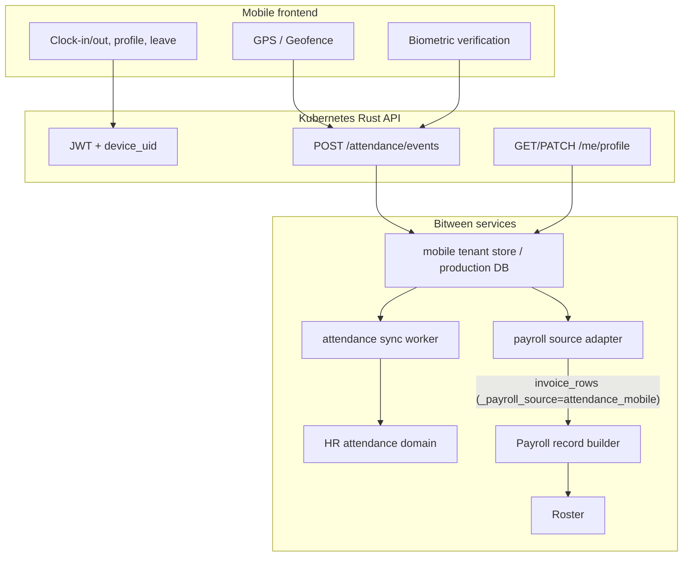

# Bitween field mobile attendance integration

This document describes the mobile attendance architecture, API surface, and roadmap for integrating field workers into Bitween payroll. Production delivery targets the Kubernetes-native Rust API and TypeScript/mobile frontend stack.

## Current codebase gap analysis

| Area | Existing implementation | Mobile integration gap |
|------|-----------|----------------|
| Attendance | `core/hr/service.py` manual attendance records | No GPS/biometric clock-in events yet |
| Payroll | Existing payroll pipeline requires invoice-like source rows | Need attendance accumulation as payroll source |
| Leave | `annual_leave_manager.py`, HR leave records | No real-time mobile leave API yet |
| Roster | `roster_constants.py`, `bank_account.py` | Email/payslip destination fields scaffolded, mobile profile API pending |
| Site | KPI `sites`, roster workplace, workflow site reports | Need geofence master data |
| Auth | `core/session_service.py` compatibility login | Need JWT/device binding for mobile API |
| Tenant | `core/tenant_data_scope.py` legal-tenant isolation | Same tenant/legal scoping required for mobile API |
| API | Service functions and compatibility adapters | Rust REST/WebSocket layer pending |

## Target architecture

### Data model (`core/mobile/models.py`)

| Model | Purpose |
|------|------|
| `SiteGeofence` | Site name, latitude, longitude, radius; matches KPI site and roster workplace |
| `EmployeeDevice` | Employee ↔ device UID |
| `BiometricEnrollmentRef` | Biometric template stays in external vault; Bitween stores only `external_ref` |
| `AttendanceEvent` | clock_in/out, GPS, verification result, work minutes |
| `PeriodWorkSummary` | Monthly/site workday and hour summary as payroll input source |

### Storage

Compatibility path:

- `{app_data_dir}/mobile/{tenant_id}/database.json`
- Development: `mobile/{tenant}/database.json`
- Pattern: `core/module_store.py`

Production target:

- Database/object storage behind Rust repositories.
- Tenant/legal scoping enforced at API and repository boundaries.
- Mobile ingestion exposed through `/api/mobile/v1/*`.

### Payroll without invoice upload

1. Mobile accumulates verified `AttendanceEvent` records.
2. `payroll_source.aggregate_period_hours(period)` creates `PeriodWorkSummary`.
3. `summaries_to_invoice_rows()` creates `build_payroll_records` compatible rows.
4. `services/workplace_hours.py` policy can select fixed hours vs accumulated attendance hours.
5. Production Rust payroll service accepts the source through the same payroll API contract.

### HR and leave integration

- `sync.push_verified_to_hr()` mirrors verified events into HR attendance records.
- Leave balance uses `annual_leave_manager` + HR leave records until Rust API parity is complete.
- Hiring/termination sync uses `core/hr/roster_sync.py` and roster workplace fields.

### Employee profile (`core/mobile/profile.py`)

- Mobile fields: `email`, `payslip_email`, `phone`, account info.
- `roster_constants` includes `이메일`, `급여명세서이메일` aliases.
- `apply_profile_to_roster_row()` updates roster after HR approval.

## API overview

All endpoints require `Authorization: Bearer <jwt>` and tenant/legal-entity scoping through `X-Tenant-Id` or JWT claims.

| Method | Path | Description |
|--------|------|------|
| POST | `/api/mobile/v1/auth/device` | Register device and bind employee |
| POST | `/api/mobile/v1/attendance/events` | Ingest one attendance event |
| GET | `/api/mobile/v1/me/profile` | Profile/account/leave summary |
| PATCH | `/api/mobile/v1/me/profile` | Update email/account fields |
| GET | `/api/mobile/v1/me/payroll/preview?period=YYYY-MM` | Preview accumulated payroll source |
| GET | `/api/mobile/v1/sites/geofences` | Assigned site geofence list |
| POST | `/api/mobile/v1/biometric/enroll` | Store external biometric enrollment reference |
| GET/POST | `/api/mobile/v1/admin/geofences` | Admin geofence CRUD |
| POST | `/api/mobile/v1/admin/sync` | Sync pending verified events |
| POST | `/api/mobile/v1/admin/payroll/aggregate?period=` | Aggregate month into payroll input source |

## Roadmap

1. Characterize current HR/payroll behavior with tests.
2. Add Rust mobile API DTOs and validation.
3. Add tenant-scoped repository and migration plan.
4. Add Kubernetes Deployment, Service, Secrets, and mobile ingestion worker.
5. Add geofence and biometric provider integrations.
6. Decommission compatibility-only mobile store after Rust parity.
