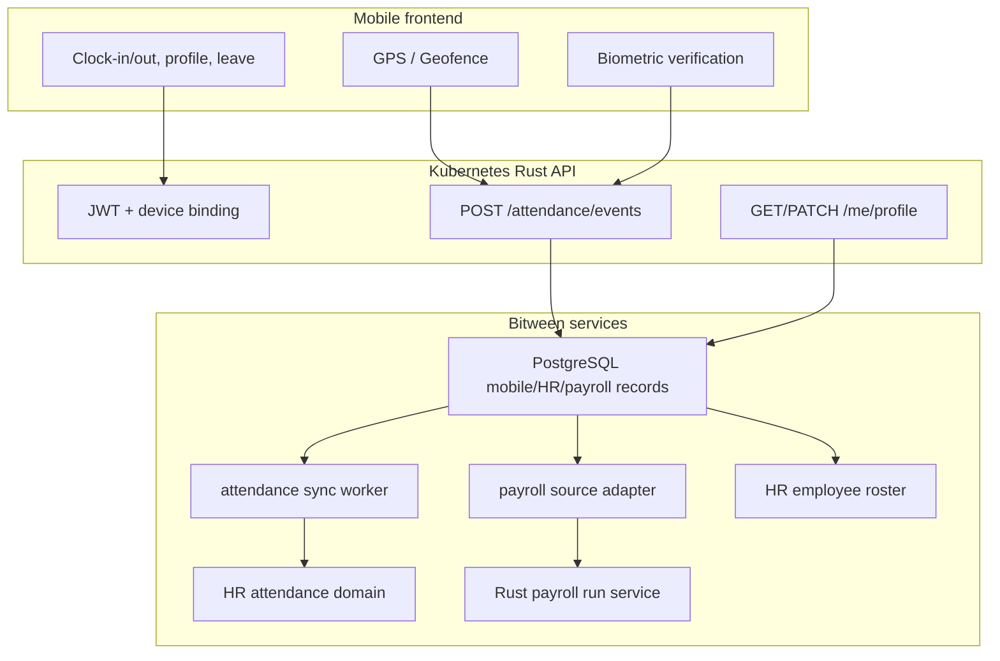

# Bitween field mobile attendance integration

This document describes the mobile attendance architecture, API surface, and
roadmap for integrating field workers into Bitween payroll. Production delivery
targets Kubernetes-native Rust APIs, PostgreSQL, RustFS where files are involved,
and TypeScript/mobile frontend contracts.

## Current codebase gap analysis

| Area | Current Rust/contract foundation | Mobile integration gap |
|------|-----------|----------------|
| Attendance | Rust payroll/attendance intake schemas and DTO contracts | GPS, device, and biometric clock events still need live ingestion routes |
| Payroll | Rust payroll contracts accept normalized attendance/payroll source data | Attendance accumulation must become a reviewed payroll source in PostgreSQL |
| Leave | HR leave balance contract is backlog-owned by the Rust HR service | Real-time mobile leave API and approval linkage remain pending |
| Roster | Rust HR employee schema owns scoped employee/workplace identity | Mobile profile update/admission needs HR approval and audit history |
| Site | KPI/site, roster workplace, and workflow location references | Geofence master data and policy enforcement remain pending |
| Auth | Rust OIDC/JWT/WebAuthn session validation and ABAC/RBAC/PBAC policy | Device binding, passkey ceremony UX, and mobile token refresh remain pending |
| Tenant | Rust authorization scopes tenant, legal entity, and workplace | Same tenant/legal scoping must be enforced on mobile APIs |
| API | Rust service contracts and TypeScript interfaces | REST/WebSocket mobile transport layer remains pending |

## Target architecture

## Data model

| Model | Purpose |
|------|------|
| `SiteGeofence` | Site name, latitude, longitude, radius; matches KPI site and workplace |
| `EmployeeDevice` | Employee-to-device binding and revocation state |
| `BiometricEnrollmentRef` | External biometric reference only; Bitween does not store biometric templates |
| `AttendanceEvent` | Clock-in/out, GPS, verification result, source confidence, and work minutes |
| `PeriodWorkSummary` | Monthly/site workday and hour summary as reviewed payroll input source |

## Storage

Production target:

- PostgreSQL stores tenant-scoped attendance, device, profile, approval, and
  payroll-source records with RLS and audit columns.
- RustFS stores any uploaded attachments or source files; PostgreSQL stores only
  metadata and object references.
- Tenant/legal scoping is enforced at API, repository, and authorization-policy
  boundaries.
- Mobile ingestion is exposed on a separated Mobile App API surface through
  versioned paths such as `/api/v1/*` and future-compatible endpoints such as
  `/api/v2/tasks`.

## Payroll without invoice upload

1. Mobile accumulates verified `AttendanceEvent` records.
2. Rust aggregation creates `PeriodWorkSummary` rows for a payroll period.
3. HR/payroll operators review anomalies, missing punches, geofence exceptions,
   and manager approvals.
4. Reviewed summaries become canonical payroll input rows in PostgreSQL.
5. The Rust payroll service accepts those rows through the same payroll API
   contract used by other intake paths.

## HR and leave integration

- Verified attendance events mirror into HR attendance records after validation.
- Leave balance comes from the Rust HR leave service backlog and must not be
  fabricated in the mobile client.
- Hiring, termination, workplace assignment, and payslip destination updates flow
  through HR approval, audit history, and tenant/workplace authorization.

## Employee profile

- Mobile fields: email, payslip email, phone, emergency contact, and account
  metadata where policy permits.
- Profile edits enter a reviewed HR workflow before updating canonical records.
- The mobile app should show clear pending/approved/rejected status for profile
  changes.

## API overview

Mobile endpoints are served by the Mobile App API surface, separate from Web
Admin API, Public Customer API, and Internal Admin API. All endpoints require
`Authorization: Bearer <jwt>` and tenant/legal-entity scoping through JWT claims
and server-side authorization policy.

| Method | Path | Description |
|--------|------|------|
| POST | `/api/v1/login` | Start configured OIDC/passkey sign-in flow |
| GET | `/api/v1/branches` | Branch/worksite list visible to the app user |
| GET | `/api/v1/tasks` | Current app action task list |
| GET | `/api/v2/tasks` | Future task payload shape for app upgrades |
| POST | `/api/v1/devices/register` | Register device and bind employee |
| POST | `/api/v1/attendance/check` | Ingest one biometric + GPS attendance event |
| GET | `/api/v1/me` | Profile/account/leave summary |
| GET | `/api/v1/payroll/{period}` | Own payroll summary or current estimate |
| GET | `/api/v1/geofence/current` | Assigned site geofence |
| POST | `/api/v1/location/geofence-event` | Shift geofence enter/exit/heartbeat |
| POST | `/api/v1/requests` | Attendance/leave workflow request |
| GET | `/api/v1/manager/alerts` | Manager geofence alerts |
| POST | `/api/v1/manager/alerts/{id}/ack` | Acknowledge manager alert |

## Roadmap

1. Add Rust mobile API DTOs, validation, and ABAC/RBAC/PBAC policies.
2. Add tenant-scoped PostgreSQL repository and migration plan.
3. Add Kubernetes Deployment, Service, Secrets, and mobile ingestion worker.
4. Add geofence and biometric-provider integrations without storing biometric
   templates in Bitween.
5. Add HR approval workflow for profile, leave, and attendance corrections.
6. Add payroll-source review/admission and rollback controls for attendance-based
   payroll inputs.
